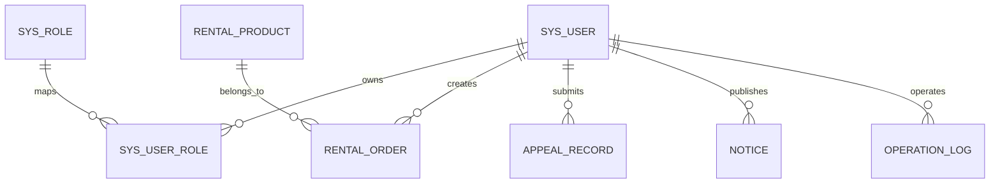

# 软件说明书（中期版）

> 使用说明
> - 本文档作为本组**中期检查**与**最终软件说明书**的共用主文档。
> - 当前版本为**中期版**，优先对照课程要求完成项目概述、需求分析、系统设计，并补充当前实现进展、测试情况和后续计划。
> - 结项阶段将在本版本基础上继续补充真实界面截图、完整测试结果、部署手册与最终总结。
> - 图片资产统一放置在 `docs/report/assets/` 目录，正文使用相对路径引用。

---

## 基本信息

**项目名称：** 三角洲行动账号租赁管理系统（DeltaRent）  
**学    院：** 计算机学院  
**小组序号：** 18  
**成员姓名：** 罗季维 / 朱江南 / 李彬菲 / 胡万军  
**指导老师：** 尹兆远  
**当前版本：** 中期版  
**更新日期：** 2026年5月7日  

---

## 一、项目概述  【中期必填】

### 1. 项目背景

“三角洲行动”相关玩家围绕账号租赁、账号展示、订单咨询、售后申诉等场景，存在较高频的信息撮合需求。现有交易方式多依赖微信群、QQ群和人工客服完成，存在以下典型问题：

- 账号资源描述不统一，用户难以快速比较不同账号的价值
- 下单、确认、交付、售后等流程依赖人工同步，效率较低
- 租赁订单、用户信息、售后记录缺乏统一沉淀
- 后台运营缺乏可视化数据统计，不利于日常管理和后续扩展

本项目围绕“账号展示 + 租赁下单 + 订单中心 + 后台运营”设计一个前后端分离的网站系统，以课程项目形式实现完整的信息系统原型。中期阶段的重点是先搭建完整骨架、打通核心业务链路、固定数据库设计，并确保仓库中有清晰的过程留痕。

### 2. 系统目标

本系统的中期与最终目标如下：

- 完成一个可运行、可演示、业务闭环明确的账号租赁管理系统原型
- 支持注册登录、账号浏览、订单创建、订单查看、个人中心、公告展示等前台核心功能
- 支持后台看板、用户管理、角色管理、账号管理、订单管理、公告管理等运营功能
- 采用前后端分离架构，形成清晰的页面层、接口层、业务层和数据层结构
- 在满足课程要求的前提下，为后续接入短信、支付、消息队列、对象存储等能力预留接口扩展空间

### 3. 开发环境

| 类别 | 当前方案 |
| --- | --- |
| 前端 | Vue 3 + TypeScript + Vite + Vue Router + Pinia + Element Plus |
| 后端 | Spring Boot 3 + Spring Security + JWT + MyBatis-Plus |
| 数据库 | MySQL 8.0 |
| 缓存/验证码预留 | Redis |
| 构建工具 | npm、Gradle Wrapper |
| 运行环境 | Node.js 24、JDK 21、Windows 11 |
| 版本管理 | Git + GitHub |
| 仓库地址 | `https://github.com/JWLuo0719/DeltaRent` |

---

## 二、需求分析  【中期必填】

### 1. 功能需求

#### 1.1 目标用户

| 角色 | 主要诉求 | 典型使用方式 |
| --- | --- | --- |
| 游客 | 查看账号资源、浏览公告、了解平台规则 | 浏览首页、账号大厅、公告信息 |
| 普通用户 | 注册登录、租赁下单、查看订单、提交申诉 | 登录后浏览账号详情、创建订单、查看订单进度 |
| 客服 | 处理订单、售后、账号状态维护 | 管理订单状态、处理用户申诉、维护账号可租状态 |
| 管理员 | 管理用户、角色、公告、账号和统计数据 | 进入后台管理台查看看板并执行管理操作 |

#### 1.2 前台功能需求

| 模块 | 主要功能 |
| --- | --- |
| 首页门户 | 平台介绍、公告展示、热点账号、业务入口 |
| 用户认证 | 注册、登录、找回密码、验证码发送 |
| 账号大厅 | 账号列表展示、关键词搜索、标签筛选、分页浏览 |
| 账号详情/下单 | 查看账号价值信息、选择租赁时长、填写联系方式并提交订单 |
| 订单中心 | 查看我的订单、按状态筛选、查看订单详情、取消订单 |
| 个人中心 | 查看资料、修改昵称、修改密码、退出登录 |
| 售后申诉 | 对已下单订单提交申诉信息并跟踪处理状态 |

#### 1.3 后台功能需求

| 模块 | 主要功能 |
| --- | --- |
| 数据看板 | 查看订单统计、用户统计、最近订单 |
| 用户管理 | 查看用户列表、按手机号/角色/状态筛选、修改角色与状态 |
| 角色管理 | 查看角色列表、创建角色、更新角色信息 |
| 账号管理 | 新增账号、编辑账号、上下架、删除账号 |
| 订单管理 | 查看全部订单、按状态过滤、修改订单状态 |
| 公告管理 | 查看公告、新增公告、修改公告、删除公告 |
| 售后处理 | 查看用户申诉、客服处理申诉结果 |

#### 1.4 主要业务流程

**业务流程一：账号租赁**

1. 用户注册或登录系统
2. 浏览账号大厅，按关键词、标签或状态筛选账号
3. 查看账号详情与资源说明，选择租赁时长并提交订单
4. 订单进入“待确认”状态
5. 客服或管理员在后台确认订单并推进状态流转
6. 用户在订单中心查看订单详情、时间线和状态变化
7. 租赁结束后可进入已完成状态，若存在问题可发起售后申诉

**业务流程二：后台运营**

1. 管理员登录后台进入数据看板
2. 管理账号信息、公告内容和订单状态
3. 维护用户角色与账号可租状态
4. 查看统计数据和最近订单，辅助日常运营管理

### 2. 非功能需求

#### 2.1 性能要求

- 常见页面和接口在课程演示环境下应保持秒级响应
- 列表查询支持分页与筛选，避免一次性加载过大数据集
- 前端资源可以稳定打包构建，后端可以稳定启动并提供 REST 接口

#### 2.2 安全要求

- 使用 `Spring Security + JWT` 实现基于令牌的身份认证
- 使用 RBAC 角色控制区分游客、普通用户、客服、管理员的访问范围
- 密码采用 `BCrypt` 加密存储，不以明文形式保存
- 后端对关键接口做权限限制，例如订单管理、用户管理、公告管理等

#### 2.3 兼容性要求

- 支持 Chrome、Edge 等主流现代浏览器
- 前台兼顾桌面端与常规移动端浏览
- 后台以桌面端操作体验为主

#### 2.4 可维护性要求

- 前后端分离，接口集中管理，便于并行开发与联调
- 业务模块按“认证、账号、订单、公告、用户、后台管理”拆分
- 数据库脚本单独维护，方便初始化和后续迭代

---

## 三、系统设计  【中期必填】

### 1. 系统架构

系统采用“Vue 前端 + Spring Boot 后端 + MySQL 数据库”的前后端分离架构。前台和后台共用一套后端接口体系，通过角色权限限制不同功能入口。


架构说明：

- 前端负责页面展示、表单校验、页面路由控制和接口调用
- 后端负责认证授权、业务规则处理、数据持久化和接口输出
- MySQL 存储用户、账号、订单、公告、申诉、日志等核心数据
- Redis 用于验证码和缓存能力预留，中期阶段数据库主链路已优先落地

### 2. 模块设计

| 模块 | 说明 | 对应仓库位置 |
| --- | --- | --- |
| 认证模块 | 登录、注册、重置密码、验证码发送、JWT 生成与校验 | `src/server/.../controller/AuthController.java`、`src/web/src/views/LoginView.vue`、`RegisterView.vue` |
| 账号模块 | 账号列表、详情、筛选、后台账号管理 | `RentalController.java`、`ProductManageView.vue`、`RentalListView.vue` |
| 订单模块 | 创建订单、我的订单、订单详情、取消订单、后台订单管理 | `OrderController.java`、`OrderListView.vue`、`OrderDetailView.vue`、`OrderManageView.vue` |
| 用户模块 | 个人资料查看与修改、密码修改、后台用户管理 | `UserController.java`、`AdminUserController.java`、`ProfileView.vue`、`UserManageView.vue` |
| 公告模块 | 前台公告展示、后台公告 CRUD | `NoticeController.java`、`NoticeManageView.vue` |
| 售后模块 | 申诉提交与后台处理 | `AppealController.java` |
| 管理台模块 | 数据看板、角色管理、运营入口 | `AdminDashboardView.vue`、`StatsView.vue`、`RoleManageView.vue` |

### 3. 数据库设计

#### 3.1 E-R 关系说明



#### 3.2 主要数据表

| 表名 | 说明 |
| --- | --- |
| `sys_user` | 用户基础信息，含用户名、手机号、密码哈希、状态、密码更新时间等 |
| `sys_role` | 角色定义，如 `ADMIN`、`USER`、`CS` |
| `sys_user_role` | 用户与角色的关联表 |
| `rental_product` | 账号商品表，保存价格、标签、哈夫币数量、装备等级、仓库价值等 |
| `rental_order` | 租赁订单表，保存订单号、用户、商品、时长、金额、状态、交付备注等 |
| `notice` | 公告内容表 |
| `sms_verify_code` | 短信验证码表，用于找回密码流程 |
| `appeal_record` | 售后申诉记录表 |
| `operation_log` | 操作日志表 |

#### 3.3 核心表设计摘要

**用户表 `sys_user`**

| 字段 | 类型 | 说明 |
| --- | --- | --- |
| `id` | BIGINT | 主键 |
| `username` | VARCHAR(50) | 用户名，唯一 |
| `phone` | VARCHAR(20) | 手机号，唯一 |
| `password_hash` | VARCHAR(255) | BCrypt 加密密码 |
| `nickname` | VARCHAR(50) | 昵称 |
| `status` | TINYINT | 用户状态 |
| `password_updated_at` | DATETIME | 密码更新时间 |
| `deleted_at` | DATETIME | 软删除字段 |

**账号表 `rental_product`**

| 字段 | 类型 | 说明 |
| --- | --- | --- |
| `id` | BIGINT | 主键 |
| `name` | VARCHAR(100) | 账号名称 |
| `category` | VARCHAR(50) | 分类 |
| `tag_text` | VARCHAR(255) | 标签 |
| `hour_price` | DECIMAL(10,2) | 小时单价 |
| `coin_amount` | BIGINT | 哈夫币数量 |
| `equipment_level_text` | VARCHAR(100) | 装备等级描述 |
| `warehouse_value_text` | VARCHAR(100) | 仓库价值描述 |
| `status` | VARCHAR(30) | 可租状态 |

**订单表 `rental_order`**

| 字段 | 类型 | 说明 |
| --- | --- | --- |
| `id` | BIGINT | 主键 |
| `order_no` | VARCHAR(40) | 订单号，唯一 |
| `user_id` | BIGINT | 下单用户 |
| `product_id` | BIGINT | 账号商品 |
| `unit_price` | DECIMAL(10,2) | 单价 |
| `rent_hours` | INT | 租赁时长 |
| `order_amount` | DECIMAL(10,2) | 订单总金额 |
| `contact_info` | VARCHAR(100) | 联系方式 |
| `delivery_note` | VARCHAR(255) | 交付备注 |
| `status` | VARCHAR(30) | 订单状态 |
| `start_time` / `end_time` | DATETIME | 租赁开始与结束时间 |

#### 3.4 初始数据

当前 SQL 初始化脚本中已预置以下测试数据：

- 3 个测试用户：管理员、普通用户、客服
- 3 个测试角色：`ADMIN`、`USER`、`CS`
- 3 个测试账号商品：高战账号、活动账号、新手试用号
- 2 条测试公告

以上内容位于 [schema_v1.sql](/d:/Project/DeltaRent/sql/schema_v1.sql:1)。

---

## 四、系统实现  【中期部分填写；结项补全】

### 1. 关键技术

#### 1.1 前端技术实现

- 使用 `Vue 3 + Composition API` 实现页面逻辑拆分
- 使用 `Vue Router` 管理游客页、用户页、后台页等多类路由
- 使用 `Pinia` 管理登录态与用户信息
- 使用 `Axios` 封装统一接口调用
- 使用 `Element Plus` 快速搭建表单、表格、分页、弹窗等交互组件

#### 1.2 后端技术实现

- 使用 `Spring Boot 3` 提供 RESTful API
- 使用 `Spring Security` 配置访问权限
- 使用 `JWT` 作为无状态登录凭证
- 使用 `MyBatis-Plus` 与 Mapper 完成数据库访问
- 使用 `Gradle Wrapper` 统一后端构建方式

#### 1.3 关键实现点

**（1）JWT 登录与权限校验**

系统登录成功后返回带有用户 ID、用户名、角色信息的 JWT。前端保存令牌，后续请求通过 `Authorization: Bearer <token>` 完成身份校验。后端结合 `Spring Security` 对不同接口做访问控制。

```java
http
    .csrf(AbstractHttpConfigurer::disable)
    .sessionManagement(session -> session.sessionCreationPolicy(SessionCreationPolicy.STATELESS))
    .authorizeHttpRequests(auth -> auth
        .requestMatchers("/api/health", "/api/auth/**", "/api/portal/**").permitAll()
        .requestMatchers("/api/dashboard/**").hasRole("ADMIN")
        .requestMatchers("/api/admin/**").hasRole("ADMIN")
        .requestMatchers(HttpMethod.GET, "/api/orders/**").authenticated()
        .requestMatchers(HttpMethod.POST, "/api/orders/**").authenticated()
        .anyRequest().authenticated()
    );
```

**（2）订单创建与状态管理**

订单模块已支持创建订单、查询我的订单、查看订单详情、取消订单，以及后台修改订单状态。中期阶段已初步形成订单状态流转逻辑。

```java
@PostMapping
public ApiResponse<Map<String, Object>> create(@RequestBody Map<String, Object> payload,
                                               @RequestHeader(value = "Authorization", required = false) String auth) {
    Long userId = extractUserId(auth);
    Long productId = toLong(payload.get("accountId"), 0L);
    Integer rentHours = toInt(payload.get("rentHours"), 1);
    String contactInfo = String.valueOf(payload.getOrDefault("contactInfo", ""));
    String deliveryNote = String.valueOf(payload.getOrDefault("remark", ""));
    RentalOrder order = orderService.create(userId, productId, rentHours, contactInfo, deliveryNote);
    ...
}
```

**（3）统一的接口层封装**

前端在 `src/web/src/api/index.ts` 中对登录、注册、账号列表、订单管理、后台管理等接口做了集中封装，便于后续联调与维护。

### 2. 界面展示

中期阶段已完成并提交源码的主要页面如下：

- 登录页
- 注册页
- 首页门户页
- 账号租赁大厅
- 创建订单页
- 我的订单页
- 订单详情页
- 个人资料页
- 后台数据看板
- 后台用户管理页
- 后台角色管理页
- 后台账号管理页
- 后台订单管理页
- 后台公告管理页

中期阶段报告先以结构和进展说明为主，真实界面截图将在结项版统一导出并补充到 `docs/report/assets/` 目录。

### 3. 核心代码片段

中期阶段已经具备以下关键源码：

- 登录注册接口：[AuthController.java](/d:/Project/DeltaRent/src/server/src/main/java/com/jwluo0719/deltatrade/controller/AuthController.java:1)
- 账号列表与账号管理接口：[RentalController.java](/d:/Project/DeltaRent/src/server/src/main/java/com/jwluo0719/deltatrade/controller/RentalController.java:1)
- 订单创建与订单管理接口：[OrderController.java](/d:/Project/DeltaRent/src/server/src/main/java/com/jwluo0719/deltatrade/controller/OrderController.java:1)
- 个人中心接口：[UserController.java](/d:/Project/DeltaRent/src/server/src/main/java/com/jwluo0719/deltatrade/controller/UserController.java:1)
- 公告接口：[NoticeController.java](/d:/Project/DeltaRent/src/server/src/main/java/com/jwluo0719/deltatrade/controller/NoticeController.java:1)
- 售后申诉接口：[AppealController.java](/d:/Project/DeltaRent/src/server/src/main/java/com/jwluo0719/deltatrade/controller/AppealController.java:1)

---

## 五、系统测试  【中期先写方案；结项补全结果】

### 1. 测试方案

#### 1.1 测试范围

- 用户注册、登录、找回密码
- 账号列表查询、筛选与浏览
- 订单创建、订单列表、订单详情、订单取消
- 个人资料修改、密码修改
- 后台用户、角色、账号、订单、公告管理入口
- 前后端项目构建与后端服务启动

#### 1.2 测试方法

- 前端静态检查：`vue-tsc`
- 前端构建测试：`vite build`
- 后端构建测试：`gradlew test`
- 后端启动测试：访问 `/api/health`
- 功能测试：以测试账号执行核心业务流程

### 2. 测试结果

截至 2026 年 5 月 7 日，已完成的中期验证如下：

| 测试项 | 执行方式 | 结果 |
| --- | --- | --- |
| 前端类型检查 | `npm --prefix src/web run typecheck` | 通过 |
| 前端生产构建 | `npm --prefix src/web run build` | 通过 |
| 后端测试任务 | `src/server/gradlew.bat test` | 通过 |
| 后端服务健康检查 | 启动后访问 `GET /api/health` | 返回 `status = UP` |

中期阶段计划继续补充的业务用例如下：

| 用例 | 步骤 | 预期结果 |
| --- | --- | --- |
| 用户注册 | 输入手机号、密码、昵称提交 | 注册成功，返回登录页 |
| 用户登录 | 输入手机号/密码提交 | 登录成功，获得 JWT 令牌 |
| 浏览账号 | 打开账号大厅并筛选 | 返回符合条件的账号列表 |
| 创建订单 | 选择账号、时长、联系方式提交 | 返回订单号并进入待确认状态 |
| 查看订单 | 进入订单中心与详情页 | 正常显示状态和订单时间线 |
| 修改资料 | 修改昵称并保存 | 返回更新后的个人资料 |
| 后台管理 | 管理员登录后台 | 可访问用户、角色、账号、订单、公告等管理模块 |

### 3. 问题与改进

| 当前问题 | 说明 | 后续改进 |
| --- | --- | --- |
| 界面截图资产尚未统一整理 | 中期版以代码和文档进展为主 | 结项前统一补充真实截图到 `assets/` |
| 前端打包产物体积偏大 | `vite build` 存在 chunk size 警告 | 后续通过路由懒加载与拆分公共包优化 |
| Redis 与短信能力尚未完整接入 | 当前重点在主业务链路 | 结项前视时间补充或保留接口预留 |
| 订单审核与售后处理的细节规则仍可继续细化 | 中期阶段已完成基础流转 | 结项阶段补充更完整的运营规则与日志记录 |

---

## 六、用户手册  【结项补全】

### 1. 安装部署说明

中期阶段已具备基础启动条件，当前可用启动方式如下：

**前端启动**

```powershell
npm --prefix src/web install
npm --prefix src/web run dev
```

**后端启动**

```powershell
cd src/server
gradlew.bat bootRun
```

**数据库初始化**

```sql
source sql/schema_v1.sql;
```

### 2. 操作指南

中期阶段的主要演示路径如下：

1. 游客访问首页与账号大厅
2. 用户注册并登录系统
3. 查看账号详情并创建订单
4. 在“我的订单”中查看订单信息
5. 进入个人中心修改资料
6. 管理员登录后台查看看板并管理用户、账号、订单、公告

> 结项阶段将在本节补充更完整的部署手册、环境变量说明和截图式使用说明。

---

## 七、项目总结  【中期可先写阶段总结；结项补全】

### 1. 成果总结

截至中期阶段，项目已完成以下内容：

- 完成项目计划书与中期主文档
- 完成前后端分离项目骨架搭建
- 完成 MySQL 数据库初版设计与初始化脚本
- 完成登录、注册、找回密码、JWT 登录态等认证基础功能
- 完成账号大厅、账号筛选、下单页、订单列表、订单详情、个人中心等前台页面
- 完成后台看板、用户管理、角色管理、账号管理、订单管理、公告管理等后台基础页面
- 完成对应的后端控制器、服务层和主要接口联调
- 完成前端构建验证、后端测试验证与健康检查验证

### 2. 不足与改进方向

当前系统已经具备中期检查所需的完整骨架与核心流程，但仍存在以下待完善点：

- 真实运营级别的短信、Redis、异步消息等能力尚未完全落地
- 界面截图、E-R 图导出图、测试结果截图等文档资产仍需继续整理
- 后台管理的部分细节规则仍以课程原型为主，后续需要进一步完善
- 结项阶段需继续补充更全面的测试记录、部署说明与用户手册

### 3. 成员分工表

| 姓名 | Git 账号 | 主要职责 | 对应产物/目录 |
| --- | --- | --- | --- |
| 罗季维 | `JWLuo0719` | 项目管理、需求分析、计划书、中期文档、总体推进 | `课程信息/`、`docs/plan/`、`docs/report/` |
| 朱江南 | `ZHU123-OK` | 后端开发、数据库设计、认证与订单接口实现 | `src/server/`、`sql/` |
| 李彬菲 | `LBF1105` | 前端开发、页面实现、前后台联调 | `src/web/` |
| 胡万军 | `erousagi37` | 测试、测试用例整理、说明书协同整理 | `docs/test/`、`docs/report/` |

> 班级与学号信息在结项导出版中补充到最终分工表。

### 4. Git 提交记录

当前远端仓库：

- `https://github.com/JWLuo0719/DeltaRent`

中期阶段与文档、联调相关的代表性提交如下：

| 提交号 | 提交说明 |
| --- | --- |
| `4c1e0c8` | `docs: 添加中期报告` |
| `9fed0c7` | `docs: 测试文件补充` |
| `4968c6b` | 统一页面风格并修复 SQL/数据库不匹配问题 |
| `207dc81` | 优化数据库与前后端接口一致性 |
| `7622b2c` | 新增数据库初始化脚本和配置文件 |
| `0699044` | 修复客服权限问题 |
| `e1bf274` | 接口完善以及中文乱码修复 |

中期阶段的 Git 留痕已经覆盖文档、数据库、前端、后端多个方面，符合课程对过程性考核的基本要求。

---

## 附录  【中期可留空；结项补全】

- 参考资料：课程模板 [2. 中期与结项报告.md](/d:/Project/DeltaRent/课程信息/2.%20中期与结项报告.md:1)
- 架构图片：`docs/report/assets/fig_architecture.png`
- 源代码仓库：`https://github.com/JWLuo0719/DeltaRent`
- 数据库脚本：[schema_v1.sql](/d:/Project/DeltaRent/sql/schema_v1.sql:1)

---

## 附：当前报告图片与文件组织方式

```text
docs/
  report/
    中期与结项报告.md
    assets/
      fig_architecture.png
```

> 结项阶段将继续在 `assets/` 中补充界面截图、测试截图、E-R 图导出图等材料。
