# 软件说明书（结项版）

> 使用说明
> - 本文档作为本组中期检查与最终软件说明书的共用主文档。
> - 当前版本为结项版，内容已根据仓库当前实现、测试材料和最终交付范围更新。
> - 图片资产统一放置在 `docs/report/assets/` 目录，正文使用相对路径引用。

---

## 基本信息

**项目名称：** 三角洲行动账号租赁管理系统（DeltaRent）  
**学    院：** 计算机学院  
**小组序号：** 18  
**成员姓名：** 罗季维 / 朱江南 / 李彬菲 / 胡万军  
**指导老师：** 尹兆远  
**当前版本：** 结项版  
**更新日期：** 2026年5月18日  

---

## 一、项目概述

### 1. 项目背景

“三角洲行动”相关玩家围绕账号租赁、账号展示、订单咨询、售后申诉等场景，存在较高频的信息撮合需求。现有交易方式多依赖微信群、QQ群和人工客服完成，存在以下问题：

- 账号资源描述不统一，用户难以快速比较账号价值
- 下单、确认、交付、售后等流程依赖人工同步，效率较低
- 订单、用户、申诉和公告信息缺乏统一沉淀
- 后台运营缺乏统一管理界面和统计视图

本项目围绕“账号展示 + 租赁下单 + 订单中心 + 后台运营”设计并实现了一个前后端分离的网站系统原型，用于完成课程要求中的需求分析、系统设计、编码实现、测试验证与文档交付。

### 2. 系统目标

本系统的最终目标如下：

- 实现一个可运行、可演示、业务链路完整的账号租赁管理系统原型
- 支持注册登录、账号浏览、账号上架、订单创建、订单查看、个人中心、公告展示等前台核心功能
- 支持后台看板、用户管理、账号管理、订单管理、公告管理等运营功能
- 采用前后端分离架构，形成清晰的页面层、接口层、业务层和数据层结构
- 在满足课程要求的前提下，为后续接入短信、支付、消息队列、对象存储等能力预留扩展空间

### 3. 开发环境

| 类别 | 当前方案 |
| --- | --- |
| 前端 | Vue 3 + TypeScript + Vite + Vue Router + Pinia + Element Plus |
| 后端 | Spring Boot 3 + Spring Security + JWT + MyBatis |
| 数据库 | MySQL 8.0 |
| 缓存/扩展预留 | Redis |
| 构建工具 | npm、Gradle Wrapper |
| 运行环境 | Node.js 24、JDK 21、Windows 11 |
| 版本管理 | Git + GitHub |
| 远端仓库 | `https://github.com/JWLuo0719/DeltaRent` |

---

## 二、需求分析

### 1. 功能需求

#### 1.1 目标用户

| 角色 | 主要诉求 | 典型使用方式 |
| --- | --- | --- |
| 游客 | 查看账号资源、浏览公告、了解平台规则 | 浏览首页、租号大厅、公告信息 |
| 普通用户 | 注册登录、账号上架、租赁下单、查看订单、提交申诉 | 登录后浏览账号详情、创建订单、发布账号、查看订单进度 |
| 客服 | 处理订单、维护账号状态、协助售后 | 进入后台处理订单和账号管理 |
| 管理员 | 管理用户、公告、账号、订单和统计数据 | 进入后台管理台查看看板并执行运营管理操作 |

#### 1.2 前台功能需求

| 模块 | 主要功能 |
| --- | --- |
| 首页门户 | 平台介绍、公告展示、热点账号、业务入口 |
| 用户认证 | 注册、登录、找回密码、验证码发送 |
| 租号大厅 | 账号列表展示、关键词搜索、标签筛选、排序、分页浏览 |
| 账号详情/下单 | 查看账号价值信息、选择租赁时长、填写联系方式并提交订单 |
| 我要上架 | 提交账号信息、自动计算租金、进入待审核状态 |
| 订单中心 | 查看我的订单、按状态筛选、查看订单详情、取消订单、申请售后 |
| 个人中心 | 查看资料、修改昵称、修改密码、退出登录 |

#### 1.3 后台功能需求

| 模块 | 主要功能 |
| --- | --- |
| 数据看板 | 查看待确认订单、进行中订单、注册用户数、最近订单 |
| 用户管理 | 查看用户列表、按手机号/角色/状态筛选、修改角色与状态 |
| 账号管理 | 新增账号、编辑账号、上下架、删除账号 |
| 订单管理 | 查看全部订单、按状态过滤、修改订单状态 |
| 公告管理 | 查看公告、新增公告、修改公告、删除公告 |
| 售后处理 | 查看用户申诉、客服处理申诉结果 |

#### 1.4 主要业务流程

**业务流程一：账号租赁**

1. 用户注册或登录系统
2. 浏览租号大厅，按关键词、标签、状态或价格筛选账号
3. 查看账号详情与资源说明，选择租赁时长并提交订单
4. 订单进入“待确认”状态
5. 客服或管理员在后台确认订单并推进状态流转
6. 用户在订单中心查看订单详情、时间线和状态变化
7. 租赁结束后进入已完成状态，若存在问题可发起售后申诉

**业务流程二：账号上架**

1. 登录用户进入“我要上架”页面
2. 填写账号标题、上号方式、哈夫币数额、比例、押金、段位、红皮等字段
3. 系统根据比例自动计算租金
4. 用户提交后账号进入待审核/维护状态
5. 管理员或客服在后台审核后再决定上架到租号大厅

**业务流程三：后台运营**

1. 管理员登录后台进入数据看板
2. 管理账号信息、公告内容、用户状态和订单状态
3. 客服在权限范围内处理账号与订单相关事务
4. 系统通过统计视图辅助日常运营管理

### 2. 非功能需求

#### 2.1 性能要求

- 页面和接口在课程演示环境下应保持秒级响应
- 列表查询支持分页与筛选，避免一次性加载过大数据集
- 前端资源能够稳定打包构建，后端能够稳定启动并提供 REST 接口

#### 2.2 安全要求

- 使用 `Spring Security + JWT` 实现基于令牌的身份认证
- 使用 RBAC 角色控制区分游客、普通用户、客服、管理员的访问范围
- 密码采用 `BCrypt` 加密存储，不以明文形式保存
- 后端对关键接口做权限限制，例如后台用户管理、订单管理、公告管理等

#### 2.3 兼容性要求

- 支持 Chrome、Edge 等主流现代浏览器
- 前台兼顾桌面端与常规移动端浏览
- 后台以桌面端操作体验为主

#### 2.4 可维护性要求

- 前后端分离，接口集中管理，便于并行开发与联调
- 业务模块按“认证、账号、订单、公告、用户、后台管理”拆分
- 数据库脚本单独维护，便于初始化和后续迭代

---

## 三、系统设计

### 1. 系统架构

系统采用“Vue 前端 + Spring Boot 后端 + MySQL 数据库”的前后端分离架构。前台和后台共用一套后端接口体系，通过角色权限限制不同功能入口。

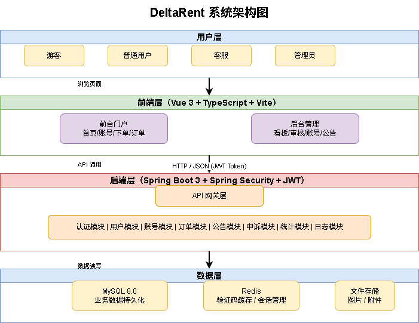

架构说明：

- 前端负责页面展示、表单校验、页面路由控制和接口调用
- 后端负责认证授权、业务规则处理、数据持久化和接口输出
- MySQL 存储用户、账号、订单、公告、申诉、日志等核心数据
- Redis 作为缓存与验证码能力预留，当前版本优先完成数据库主链路

### 2. 模块设计

| 模块 | 说明 | 对应实现 |
| --- | --- | --- |
| 认证模块 | 登录、注册、找回密码、验证码发送、JWT 生成与校验 | `AuthController`、`LoginView.vue`、`RegisterView.vue` |
| 账号模块 | 账号列表、详情、筛选、后台账号管理、用户上架账号 | `RentalController`、`RentalListView.vue`、`RentalPublishView.vue`、`ProductManageView.vue` |
| 订单模块 | 创建订单、我的订单、订单详情、取消订单、后台订单管理 | `OrderController`、`OrderListView.vue`、`OrderDetailView.vue`、`OrderManageView.vue` |
| 用户模块 | 个人资料查看与修改、密码修改、后台用户管理 | `UserController`、`AdminUserController`、`ProfileView.vue`、`UserManageView.vue` |
| 公告模块 | 前台公告展示、后台公告 CRUD | `NoticeController`、`NoticeManageView.vue` |
| 售后模块 | 申诉提交与后台处理 | `AppealController` |
| 看板模块 | 指标概览、最近订单、后台主入口 | `DashboardController`、`StatsView.vue`、`AdminDashboardView.vue` |

### 3. 数据库设计

#### 3.1 E-R 关系说明

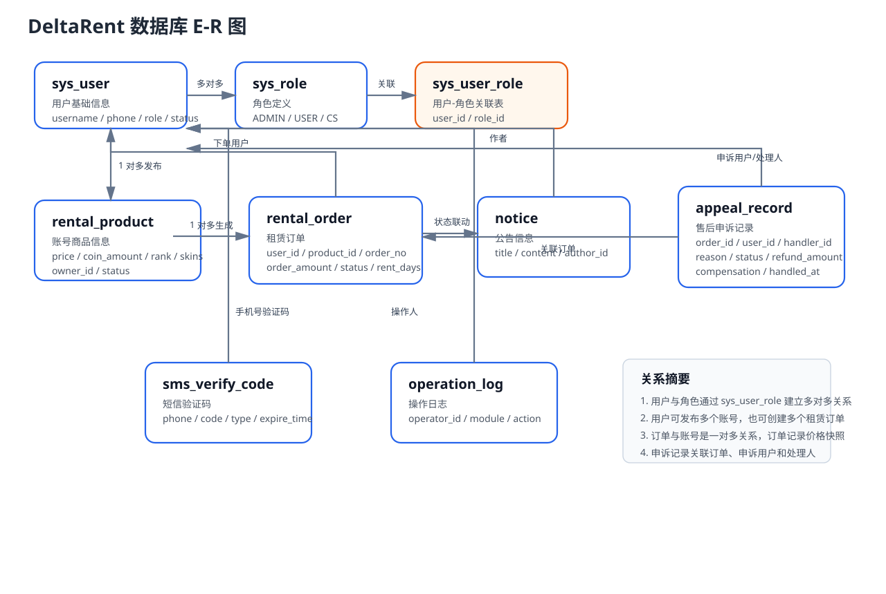

E-R 图说明：

- `sys_user` 与 `sys_role` 通过 `sys_user_role` 建立多对多关系
- `sys_user` 与 `rental_product` 为一对多关系，表示用户可以发布多个账号商品
- `sys_user` 与 `rental_order` 为一对多关系，表示用户可以创建多个租赁订单
- `rental_product` 与 `rental_order` 为一对多关系，表示一个账号商品可对应多个历史订单
- `appeal_record` 关联订单、申诉用户和处理人，用于记录售后处理过程
- `notice` 与 `operation_log` 分别记录公告发布和后台操作行为

#### 3.2 主要数据表

| 表名 | 说明 |
| --- | --- |
| `sys_user` | 用户基础信息，含用户名、手机号、密码哈希、状态、密码更新时间等 |
| `sys_role` | 角色定义，如 `ADMIN`、`USER`、`CS` |
| `sys_user_role` | 用户与角色的关联表 |
| `rental_product` | 账号商品表，保存价格、标签、哈夫币数量、段位、皮肤等字段 |
| `rental_order` | 租赁订单表，保存订单号、用户、商品、时长、金额、状态、交付备注等 |
| `notice` | 公告内容表 |
| `sms_verify_code` | 短信验证码表，用于找回密码流程 |
| `appeal_record` | 售后申诉记录表 |
| `operation_log` | 操作日志表 |

#### 3.3 核心表设计摘要

**用户表 `sys_user`**

| 字段 | 类型 | 说明 |
| --- | --- | --- |
| `id` | BIGINT | 主键 |
| `username` | VARCHAR(50) | 用户名，唯一 |
| `phone` | VARCHAR(20) | 手机号，唯一 |
| `password_hash` | VARCHAR(255) | BCrypt 加密密码 |
| `nickname` | VARCHAR(50) | 昵称 |
| `status` | TINYINT | 用户状态 |
| `password_updated_at` | DATETIME | 密码更新时间 |
| `deleted_at` | DATETIME | 软删除字段 |

**账号表 `rental_product`**

| 字段 | 类型 | 说明 |
| --- | --- | --- |
| `id` | BIGINT | 主键 |
| `name` | VARCHAR(100) | 账号标题 |
| `category` | VARCHAR(50) | 分类 |
| `tag_text` | VARCHAR(255) | 标签 |
| `hour_price` | DECIMAL(10,2) | 小时单价 |
| `coin_amount` | BIGINT | 哈夫币数量 |
| `rank_text` / `character_skin_text` / `knife_skin_text` | VARCHAR | 三角洲账号扩展字段 |
| `status` | VARCHAR(30) | 可租状态 |

**订单表 `rental_order`**

| 字段 | 类型 | 说明 |
| --- | --- | --- |
| `id` | BIGINT | 主键 |
| `order_no` | VARCHAR(40) | 订单号，唯一 |
| `user_id` | BIGINT | 下单用户 |
| `product_id` | BIGINT | 账号商品 |
| `unit_price` | DECIMAL(10,2) | 单价 |
| `rent_hours` | INT | 租赁时长 |
| `order_amount` | DECIMAL(10,2) | 订单总金额 |
| `contact_info` | VARCHAR(100) | 联系方式 |
| `delivery_note` | VARCHAR(255) | 交付备注 |
| `status` | VARCHAR(30) | 订单状态 |
| `start_time` / `end_time` | DATETIME | 租赁开始与结束时间 |

#### 3.4 初始数据

当前 SQL 初始化脚本中已预置以下测试数据：

- 3 个测试用户：管理员、普通用户、客服
- 3 个测试角色：`ADMIN`、`USER`、`CS`
- 多个测试账号商品
- 测试公告

数据库脚本位于 [schema_v2.sql](/d:/Project/DeltaRent/sql/schema_v2.sql:1)。

---

## 四、系统实现

### 1. 关键技术

#### 1.1 前端实现

- 使用 `Vue 3 + Composition API` 实现页面逻辑拆分
- 使用 `Vue Router` 管理游客页、用户页、后台页等多类路由
- 使用动态导入优化路由加载
- 使用 `Pinia` 管理登录态与用户信息
- 使用 `Axios` 统一处理请求头注入和 401 响应跳转
- 使用 `Element Plus` 搭建表单、表格、分页、弹窗等交互组件

#### 1.2 后端实现

- 使用 `Spring Boot 3` 提供 RESTful API
- 使用 `Spring Security` + JWT 完成登录鉴权与接口权限控制
- 使用 `MyBatis`/Mapper 完成数据库访问
- 使用 `Gradle Wrapper` 统一后端构建方式
- 使用服务层封装订单、账号、用户、公告、申诉等业务规则

#### 1.3 关键实现点

**（1）JWT 登录与权限校验**

系统登录成功后返回包含用户 ID、用户名和角色的 JWT。前端通过请求拦截器自动附带 `Authorization` 请求头，后端基于 Spring Security 做访问控制。

```java
http
    .csrf(AbstractHttpConfigurer::disable)
    .sessionManagement(session -> session.sessionCreationPolicy(SessionCreationPolicy.STATELESS))
    .authorizeHttpRequests(auth -> auth
        .requestMatchers("/api/health", "/api/auth/**", "/api/portal/**").permitAll()
        .requestMatchers(HttpMethod.GET, "/api/rentals/**", "/api/notices/**").permitAll()
        .requestMatchers("/api/dashboard/**").hasRole("ADMIN")
        .requestMatchers("/api/admin/**").hasRole("ADMIN")
        .requestMatchers("/api/appeals/**").authenticated()
        .anyRequest().authenticated()
    )
    .addFilterBefore(jwtAuthFilter, UsernamePasswordAuthenticationFilter.class);
```

**（2）订单状态流转控制**

订单模块支持创建订单、查看我的订单、查看订单详情、取消订单，以及后台修改订单状态。服务层对非法状态跳转做了限制。

```java
RentalOrder order = orderService.create(userId, productId, rentHours, contactInfo, deliveryNote);
orderService.transitionStatus(order.getId(), "IN_PROGRESS");
orderService.transitionStatus(order.getId(), "COMPLETED");
```

**（3）账号上架与租金自动计算**

“我要上架”页面支持输入账号三角洲专属字段，并根据“哈夫币数额 / 比例”自动计算租金，提交后默认进入待审核状态。

**（4）统一接口层封装**

前端在 `src/web/src/api/index.ts` 中对登录、注册、账号列表、订单管理、后台管理等接口做了集中封装，便于联调与维护。

### 2. 界面展示

结项阶段已完成主要页面截图整理，图片均存放在 `docs/report/assets/` 目录。以下展示系统前台与后台的核心界面。

#### 2.1 用户认证与首页门户

登录页：提供手机号/密码登录入口，并根据登录结果写入 JWT 和用户角色信息。  
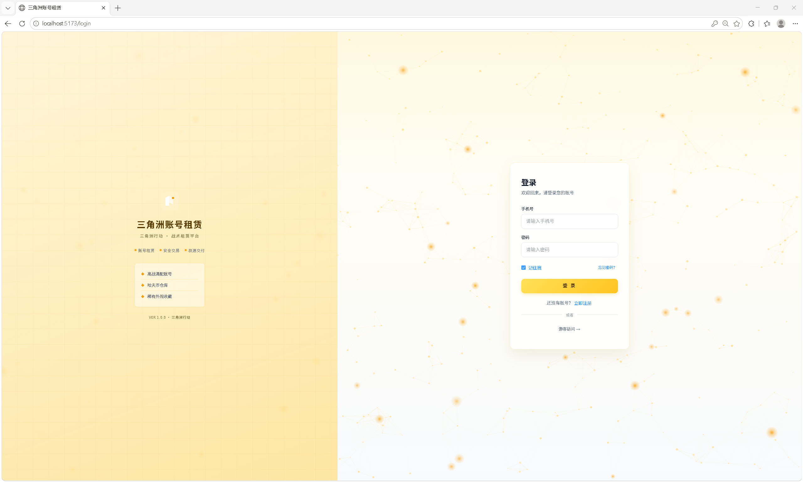

注册页：提供手机号注册、密码校验和昵称填写功能，是新用户进入系统的第一步。  
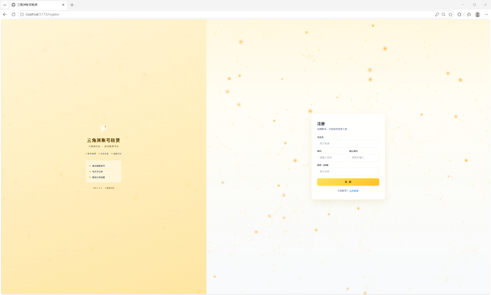

首页门户页：展示平台介绍、热门账号、业务入口与公告信息。  
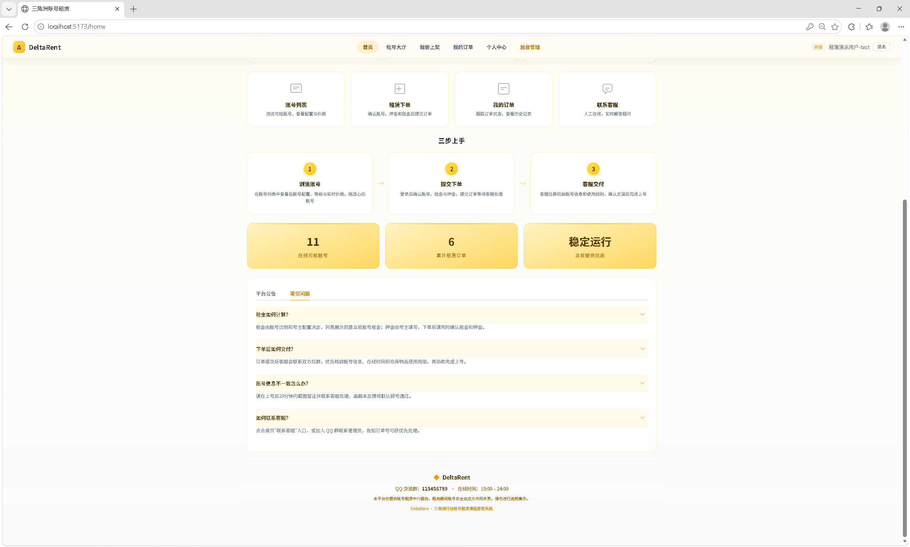

首页门户页下半部分：补充业务说明、推荐内容和页面导航。  
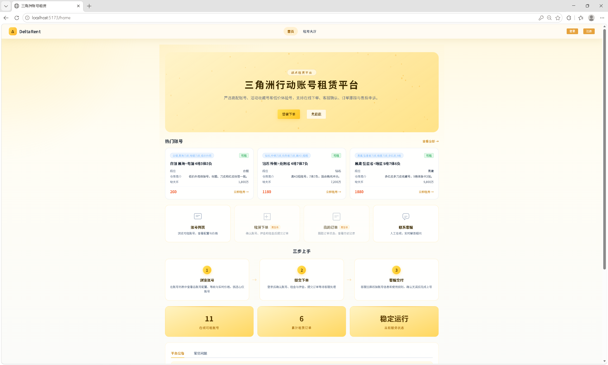

#### 2.2 账号租赁业务页面

租号大厅：展示账号列表、筛选项、价格与账号关键属性，是用户浏览和挑选账号的主页面。  
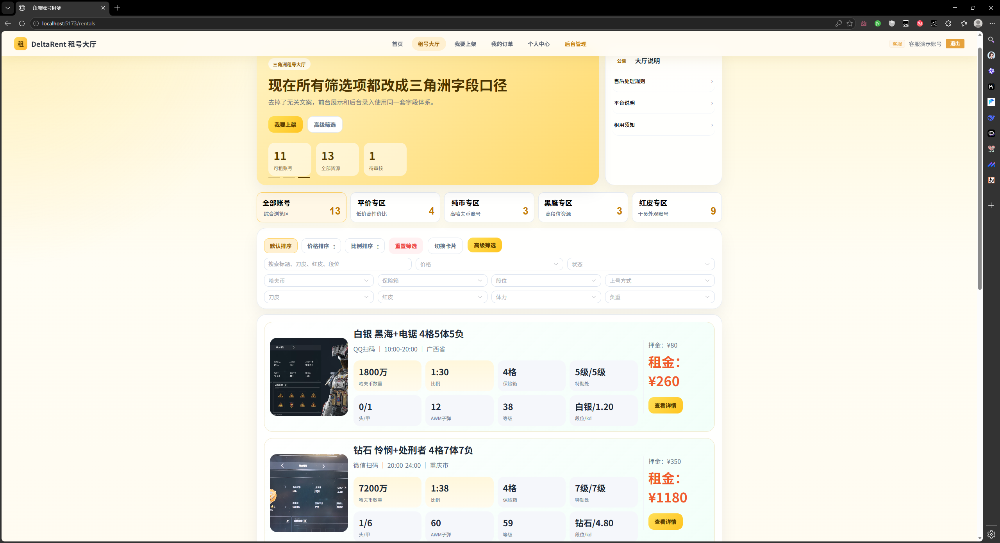

创建订单页：用户在选定账号后填写租赁时长和联系方式，生成租赁订单。  
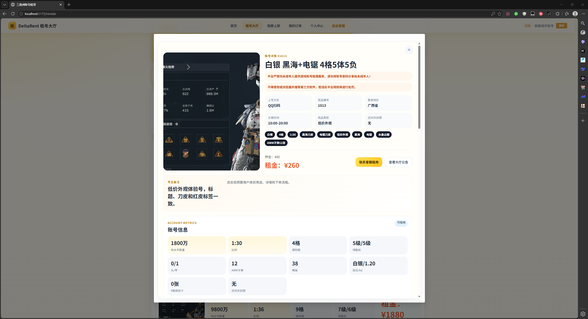

我要上架页：登录用户可提交账号资源信息，系统根据比例自动计算租金，并进入待审核状态。  
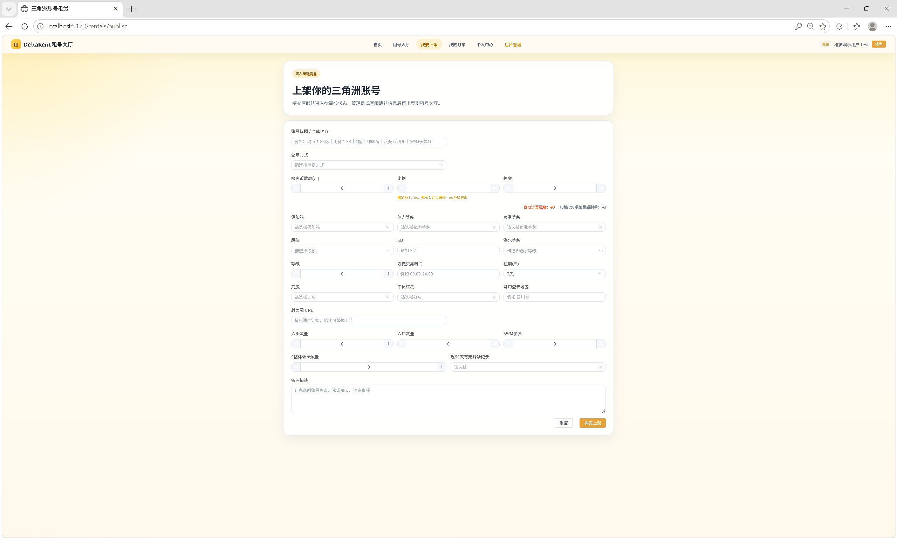

我的订单页：集中展示当前用户的订单列表，支持按状态筛选。  
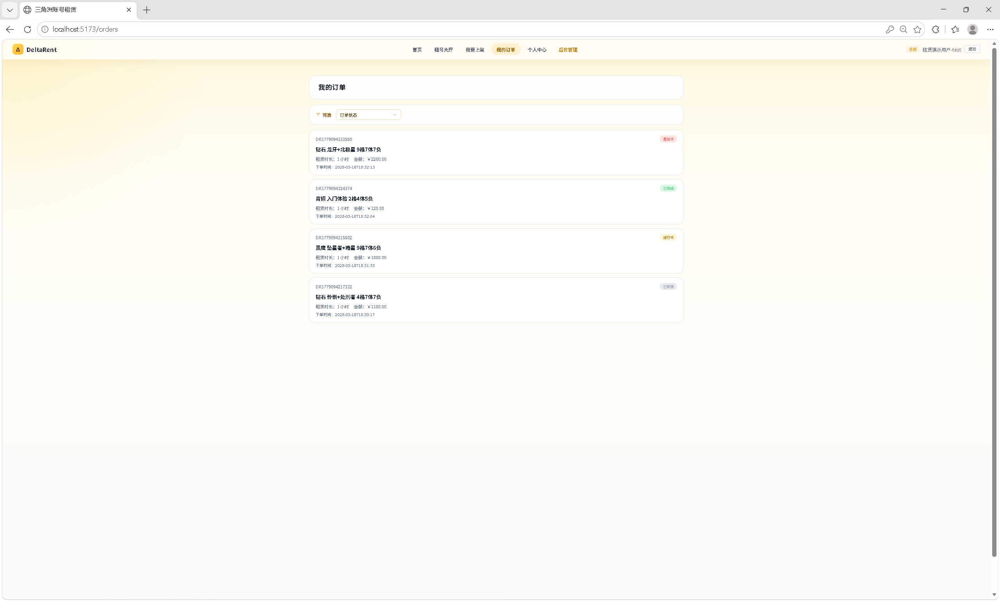

订单详情页：展示订单基础信息、状态、时间线与操作入口。  
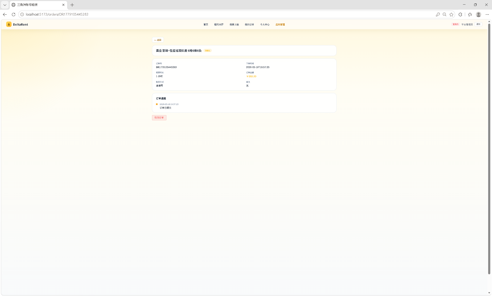

个人中心页：支持查看个人资料、修改昵称和修改密码。  
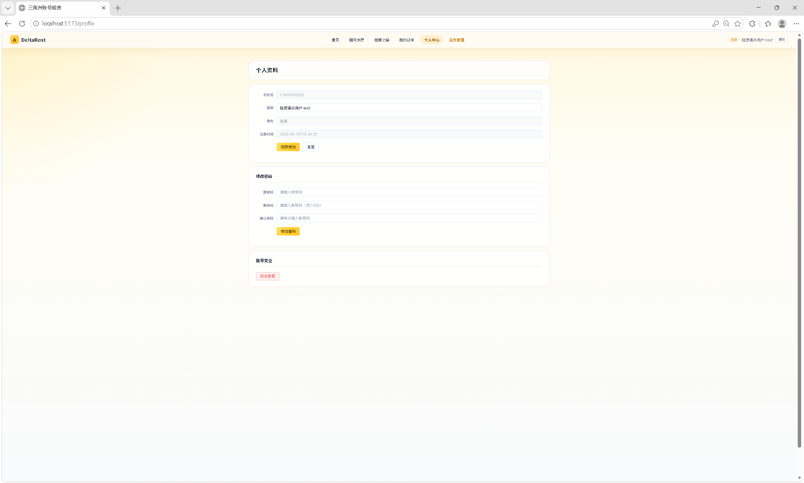

#### 2.3 后台管理页面

后台数据看板：展示待确认订单、进行中订单、注册用户数和最近订单，是后台管理的总入口。  
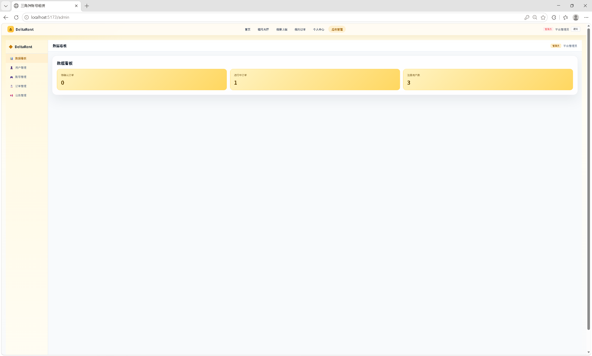

后台用户管理页：支持按手机号、角色、状态筛选用户，并进行角色或状态调整。  
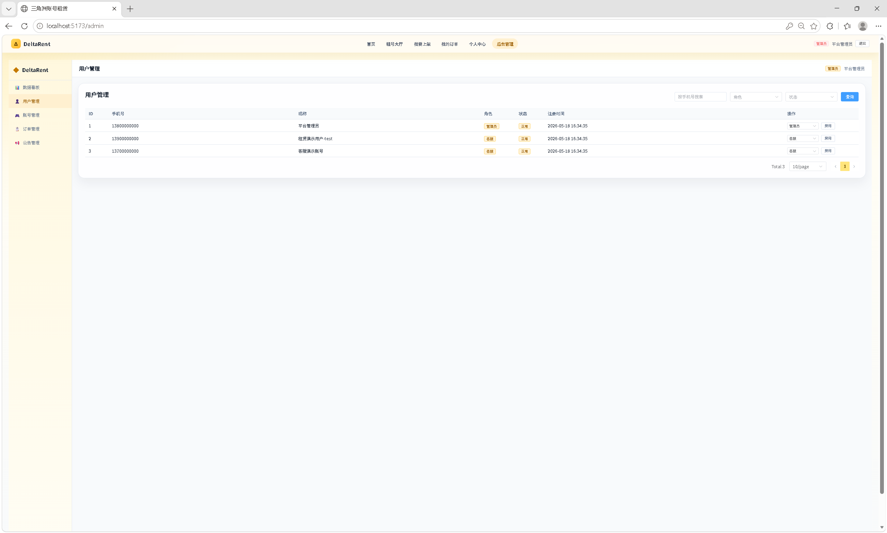

后台账号管理页：用于新增、编辑、上下架和删除账号商品，维护租号大厅数据。  
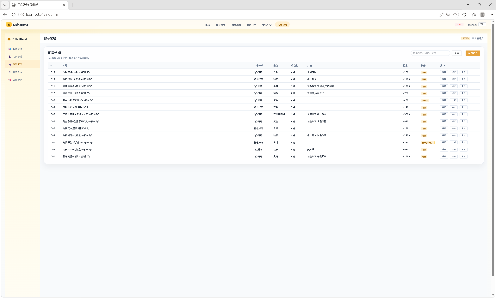

后台订单管理页：支持查看全部订单并推进订单状态流转。  
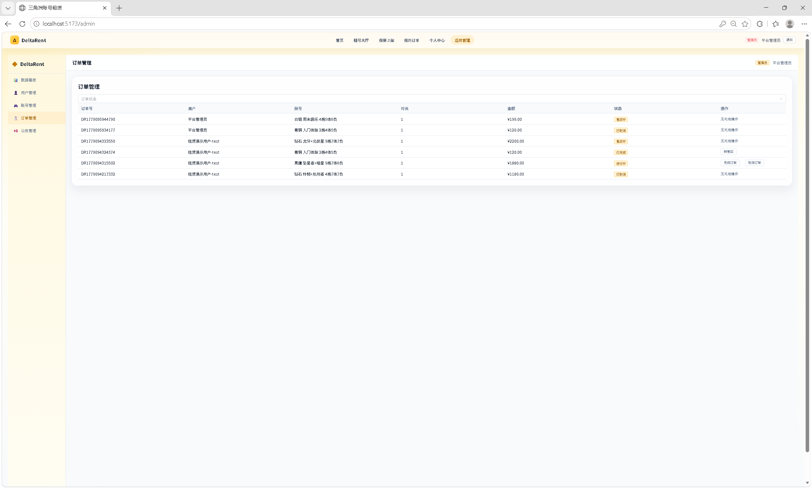

后台公告管理页：支持创建、修改和删除公告，用于前台内容运营。  
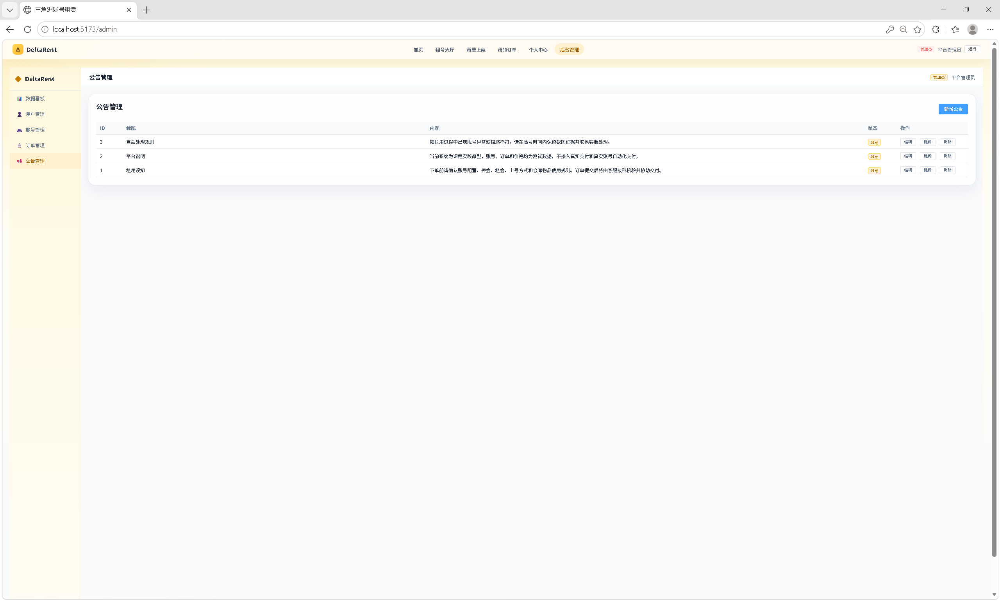

以上页面覆盖了本系统最终交付版本中的主要业务入口、用户主流程和后台管理流程，可满足课程结项展示与答辩演示需要。

### 3. 核心代码片段

当前版本的关键实现入口如下：

- 登录注册接口：[AuthController.java](/d:/Project/DeltaRent/src/server/src/main/java/com/jwluo0719/deltatrade/controller/AuthController.java:1)
- 账号列表与账号管理接口：[RentalController.java](/d:/Project/DeltaRent/src/server/src/main/java/com/jwluo0719/deltatrade/controller/RentalController.java:1)
- 订单创建与订单管理接口：[OrderController.java](/d:/Project/DeltaRent/src/server/src/main/java/com/jwluo0719/deltatrade/controller/OrderController.java:1)
- 个人中心接口：[UserController.java](/d:/Project/DeltaRent/src/server/src/main/java/com/jwluo0719/deltatrade/controller/UserController.java:1)
- 公告接口：[NoticeController.java](/d:/Project/DeltaRent/src/server/src/main/java/com/jwluo0719/deltatrade/controller/NoticeController.java:1)
- 售后申诉接口：[AppealController.java](/d:/Project/DeltaRent/src/server/src/main/java/com/jwluo0719/deltatrade/controller/AppealController.java:1)
- JWT 工具类：[JwtUtil.java](/d:/Project/DeltaRent/src/server/src/main/java/com/jwluo0719/deltatrade/common/JwtUtil.java:1)

---

## 五、系统测试

### 1. 测试方案

#### 1.1 测试范围

- 用户注册、登录、找回密码
- 账号列表查询、筛选、浏览和详情查看
- 账号上架流程
- 订单创建、订单列表、订单详情、取消订单、售后申诉
- 个人资料修改、密码修改
- 后台用户、账号、订单、公告管理入口
- 前后端项目构建与后端服务启动

#### 1.2 测试方法

- 前端静态检查：`vue-tsc`
- 前端构建测试：`vite build`
- 后端服务层测试：`gradlew test`
- 后端启动测试：访问 `/api/health`
- 人工功能测试：基于真实后端逐模块执行测试用例

### 2. 测试结果

#### 2.1 工程验证结果

| 测试项 | 执行方式 | 结果 |
| --- | --- | --- |
| 前端类型检查 | `npm --prefix src/web run typecheck` | 通过 |
| 前端生产构建 | `npm --prefix src/web run build` | 通过 |
| 后端服务层测试 | `src/server/gradlew.bat test` | 通过 |
| 后端服务健康检查 | 启动后访问 `GET /api/health` | 返回 `status = UP` |

#### 2.2 业务测试结果

依据 [测试报告.md](/d:/Project/DeltaRent/docs/test/测试报告.md:1) 与 [测试用例.md](/d:/Project/DeltaRent/docs/test/测试用例.md:1)，当前版本已完成 110 个功能测试用例，全部通过。

| 模块 | 用例数 | 通过 | 失败 | 通过率 |
| --- | --- | --- | --- | --- |
| 注册模块 | 7 | 7 | 0 | 100% |
| 登录模块 | 8 | 8 | 0 | 100% |
| 首页模块 | 13 | 13 | 0 | 100% |
| 租号大厅模块 | 18 | 18 | 0 | 100% |
| 我要上架模块 | 8 | 8 | 0 | 100% |
| 我的订单模块 | 6 | 6 | 0 | 100% |
| 个人中心模块 | 9 | 9 | 0 | 100% |
| 管理员模块 | 29 | 29 | 0 | 100% |
| 游客模块 | 5 | 5 | 0 | 100% |
| 找回密码模块 | 7 | 7 | 0 | 100% |
| **合计** | **110** | **110** | **0** | **100%** |

#### 2.3 服务层测试覆盖点

后端当前已实现服务层测试文件：

- `OrderServiceTest`：验证订单金额计算、不可租账号拦截、重复下单拦截、状态流转约束
- `ProductServiceTest`：验证账号筛选、排序、分类过滤、非法创建拦截

### 3. 问题与改进

| 当前问题 | 说明 | 后续改进 |
| --- | --- | --- |
| 前端打包产物体积偏大 | `vite build` 存在 chunk size 警告 | 后续通过更细粒度路由懒加载和公共包拆分优化 |
| 界面截图资产仍不完整 | 当前仓库主要保留架构图与测试文档 | 如需正式归档，可补充登录页、后台页、订单页截图 |
| 短信、支付、对象存储未接入真实外部服务 | 当前为课程原型 | 后续如继续开发，可替换为真实三方服务 |

---

## 六、用户手册

### 1. 安装部署说明

#### 1.1 环境要求

- Node.js 20 或更高版本
- JDK 21
- MySQL 8.0
- Windows PowerShell 或兼容终端

后端默认连接本地 MySQL：

```text
数据库：deltarent
地址：localhost:3306
账号：root
密码：123456
```

如需修改数据库配置，编辑 [application.yml](/d:/Project/DeltaRent/src/server/src/main/resources/application.yml:1)。

#### 1.2 数据库初始化

在 MySQL 中执行：

```sql
source sql/schema_v2.sql;
```

也可以在 Windows 下执行：

```powershell
.\sql\init.bat
```

#### 1.3 启动后端

```powershell
cd src/server
.\gradlew.bat bootRun
```

后端默认地址：

```text
http://localhost:8080
```

健康检查：

```text
GET http://localhost:8080/api/health
```

#### 1.4 启动前端

首次运行先安装依赖：

```powershell
npm --prefix src/web install
```

启动开发服务器：

```powershell
npm --prefix src/web run dev
```

前端默认地址：

```text
http://localhost:5173
```

### 2. 操作指南

#### 2.1 普通用户使用流程

1. 访问首页或租号大厅
2. 注册并登录系统
3. 浏览账号列表，按标签、价格或状态筛选
4. 查看账号详情后创建订单
5. 在“我的订单”中查看订单状态和详情
6. 如需售后，可对订单发起申诉
7. 如有账号资源，也可进入“我要上架”页面提交账号信息

#### 2.2 管理员/客服使用流程

1. 使用管理员或客服账号登录
2. 进入后台管理页面
3. 查看看板指标和最近订单
4. 对账号状态、订单状态和公告内容执行管理操作
5. 管理员可进一步执行用户管理操作

#### 2.3 演示账号

初始密码均为：

```text
123456
```

| 角色 | 手机号 | 说明 |
| --- | --- | --- |
| 管理员 | 13800000000 | 可访问后台用户、账号、订单、公告管理 |
| 普通用户 | 13900000000 | 可浏览账号、创建订单、查看订单 |
| 客服 | 13700000000 | 可处理账号与订单相关管理功能 |

---

## 七、项目总结

### 1. 成果总结

截至结项阶段，项目已完成以下内容：

- 完成项目计划书、中期与结项报告、测试文档等课程材料
- 完成前后端分离项目结构搭建
- 完成 MySQL 数据库建表、初始化与迁移脚本
- 完成注册、登录、找回密码、JWT 登录态、权限控制等认证功能
- 完成租号大厅、账号筛选、下单页、订单列表、订单详情、个人中心、我要上架等前台页面
- 完成后台看板、用户管理、账号管理、订单管理、公告管理等后台页面
- 完成对应的后端控制器、服务层与数据库访问逻辑
- 完成 110 个功能测试用例和服务层测试，前后端可稳定构建运行

### 2. 不足与改进方向

当前系统已经满足课程结项展示要求，但仍有以下限制：

- 当前系统仍是课程原型，不接入真实支付、真实短信网关和真实游戏自动化能力
- 部分运营流程仍以手动审核和课程演示逻辑为主
- 还可以继续补充更多自动化测试与前端性能优化
- 若后续继续演进，可进一步接入对象存储、消息通知和完整审计日志

### 3. 成员分工表

| 姓名 | Git 账号 | 主要职责 | 对应产物/目录 |
| --- | --- | --- | --- |
| 罗季维 | `JWLuo0719` | 项目管理、需求分析、计划书、主文档整理、总体推进 | `课程信息/`、`docs/plan/`、`docs/report/` |
| 朱江南 | `ZHU123-OK` | 后端开发、数据库设计、认证与订单接口实现 | `src/server/`、`sql/` |
| 李彬菲 | `LBF1105` | 前端开发、页面实现、前后台联调、界面优化 | `src/web/` |
| 胡万军 | `erousagi37` | 测试用例整理、测试报告、文档协同整理 | `docs/test/`、`docs/report/` |

### 4. Git 提交记录

远端仓库：

- `https://github.com/JWLuo0719/DeltaRent`

结项阶段代表性提交如下：

| 提交号 | 提交说明 |
| --- | --- |
| `6c6f744` | Merge branch `docs-test` |
| `aef6d31` | 完成全部测试用例和测试报告，通过率 100% |
| `3f681de` | 完成个人中心模块测试用例 |
| `c9b0f00` | 更新我的订单模块测试用例 |
| `7580e63` | 补充我要上架模块审核流程测试用例 |
| `ad5f1d0` | 完成租号大厅和我要上架模块测试用例 |
| `aa589e5` | 优化订单列表筛选体验，修复租号/下单流程并完善布局 |
| `64a72c3` | 修复账号加载失败问题，重构数据库和前后端对应关系 |

---

## 附录

- 课程模板：[课程信息/2. 中期与结项报告.md](/d:/Project/DeltaRent/课程信息/2.%20中期与结项报告.md:1)
- 系统架构图：`docs/report/assets/fig_architecture.png`
- 测试报告：[docs/test/测试报告.md](/d:/Project/DeltaRent/docs/test/测试报告.md:1)
- 测试用例：[docs/test/测试用例.md](/d:/Project/DeltaRent/docs/test/测试用例.md:1)
- 数据库脚本：[sql/schema_v2.sql](/d:/Project/DeltaRent/sql/schema_v2.sql:1)
- 源代码仓库：`https://github.com/JWLuo0719/DeltaRent`

---

## 附：当前报告图片与文件组织方式

```text
docs/
  report/
    中期与结项报告.md
    assets/
      01-login.png
      02-register.png
      03-home-1.png
      03-home-2.png
      04-rentals.png
      05-order-create.png
      06-publish.png
      07-orders.png
      08-order-detail.png
      09-profile.png
      10-admin-dashboard.png
      11-admin-users.png
      12-admin-accounts.png
      13-admin-orders.png
      14-admin-notice.png
      fig_architecture.png
      fig_er.svg
```
